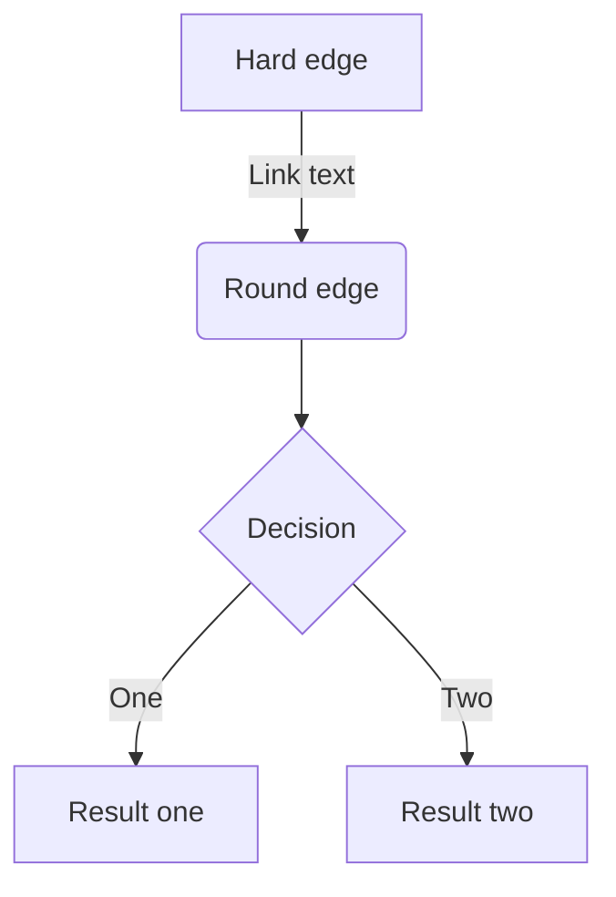

## 見出し 2

### 見出し 3

#### 見出し 4

```rb:test.rb

def test
return true
end
```

> 引用文

1. First
2. Second

- Hello!
- Hola!
  - Bonjour!
  * Hi!

| Head | Head | Head |
| ---- | ---- | ---- |
| Text | Text | Text |
| Text | Text | Text |


